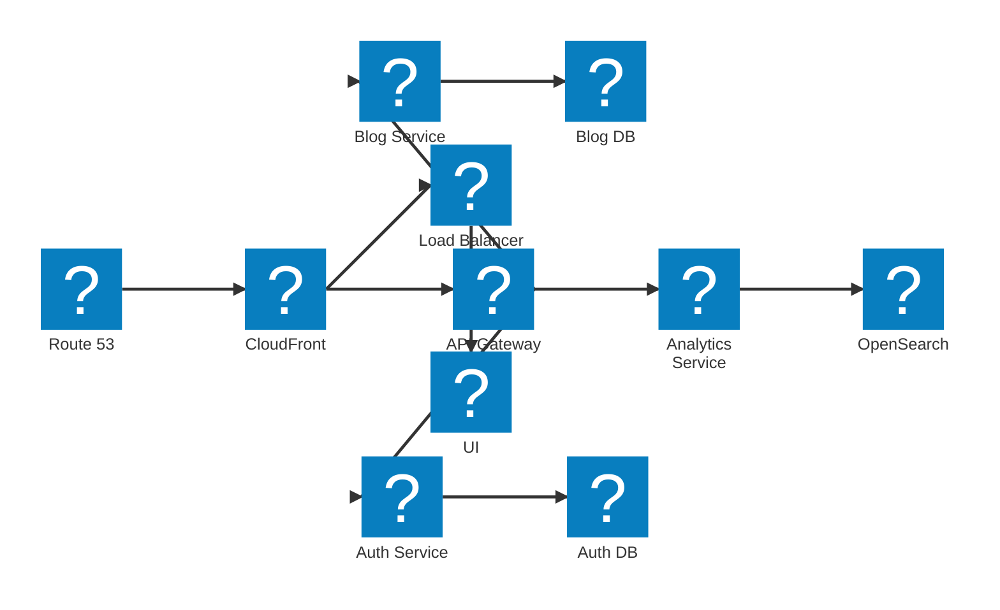

# AWS Network Architecture (with icons)

```mermaid
architecture-beta
    service dns(logos:aws-route53)[Route 53]
    service cf(logos:aws-cloudfront)[CloudFront]
    service lb(logos:aws-ec2)[Load Balancer]
    service ui(logos:nextjs)[UI]
    service gateway(logos:aws-api-gateway)[API Gateway]
    service auth(logos:aws-vpc)[Auth Service]
    service authDb(logos:aws-dynamodb)[Auth DB]
    auth:R --> L:authDb
    service blog(logos:aws-lambda)[Blog Service]
    service blogDb(logos:aws-dynamodb)[Blog DB]
    blog:R --> L:blogDb
    service analytics(logos:aws-lambda)[Analytics Service]
    service analyticsIndex(logos:aws-open-search)[OpenSearch]
    analytics:R --> L:analyticsIndex
    dns:R --> L:cf
    cf:R --> L:lb
    lb:B --> T:ui
    cf:R --> L:gateway
    gateway:R --> L:auth
    gateway:R --> L:blog
    gateway:R --> L:analytics
```